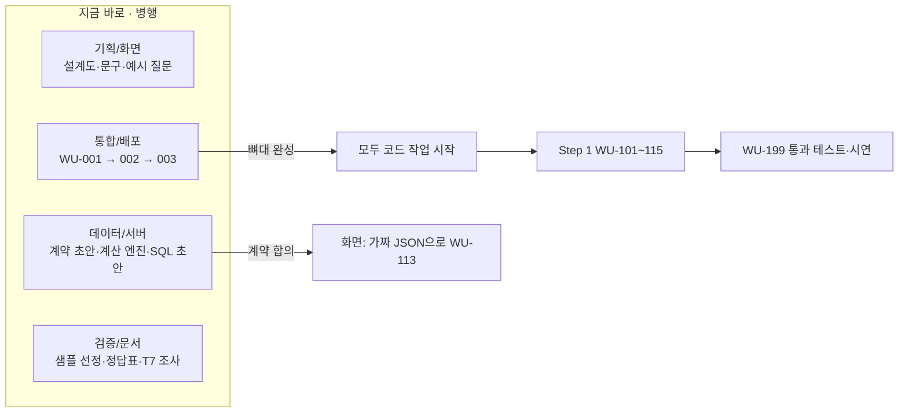

# HANDOFF — 팀 업무분장과 작업 착수 안내

| 항목 | 내용 |
|---|---|
| 프로젝트 | project_sleepyheads — 질문형 기업 분석 서비스 (공시 숫자 + 뉴스 단서) |
| 작성자 | Sung, Hyun-Joon · Lee, Yelim · ByeongJun Min |
| 작성일 | 2026-09-28 |
| 기준 문서 | [PRD](DevelopDoc/PRD.md) v0.6.1 · [TECH_SPEC](DevelopDoc/TECH_SPEC.md) v0.6.3 · [API_SPEC](DevelopDoc/API_SPEC.md) v0.3.7 · [WORK_UNITS](DevelopDoc/WORK_UNITS.md) v0.4.0 · [FINAL_CHECKLIST](DevelopDoc/FINAL_CHECKLIST.md) v0.3.1 |

### 변경 이력
| 날짜 | 내용 |
|---|---|
| 2026-09-28 | 최초 작성 (역할 4개, 첫 작업, 계약, 키 관리, 협업 규칙) |
| 2026-09-28 | 백엔드 구성(Supabase + Vercel) 확정, **API_SPEC 추가**에 따라 역할별 첫 작업·계약·환경변수·첫 주 목표 갱신 |
| 2026-09-29 | **서비스 범위 밖 질문 정중한 거절**(AI 오남용 방지) 추가에 따라 기획/화면 문구·데이터/서버 판정·검증/문서 회귀 질문 작업 갱신, FINAL_CHECKLIST 작성 완료 |
| 2026-09-29 | WU-001 완료, 서버 API 뼈대 반영(API_SPEC v0.2.2), Next.js 16 `proxy.ts` 이름 반영 |
| 2026-09-29 | WU-112 완료·WU-113 화면(가짜 데이터 기준) 완료, **뉴스 출처 Google 뉴스 RSS로 교체**(네이버 키 불필요), **분석 글을 투자 인사이트(투자 포인트)로 전환**, 주가 API 주소 V2 반영 |
| 2026-09-29 | **§0 이어서 시작하기 추가** (하루 마감 기준 진행 현황·결정·다음 할 일), 서버 작업 WU-101~107(PR #7·#8) main 반영, 외부 키 4개 시험 호출 성공, 배포 주소 동작 확인, 담당자 이름 기입, `pnpm check:keys` 추가 |
| 2026-09-29 | 서버 오류(`INTERNAL_ERROR`) 안내 화면 추가 — "잠시 후 다시 시도" + 요청 ID 표시 (§0.3 6번 앞부분 완료), 가짜 모드 "서버 오류" 추가 |
| 2026-09-29 | WU-108 구글 로그인 코드 연결 (§0.3 3번, PR #9·#10 합침 — 서버 쪽은 병준님 구현 기준, 열린 주소 이동 보안 수정 포함), 서버 작업은 WU-110 진행 중 |
| 2026-09-29 | WU-109~111 서버 파이프라인(예림님 PR #11) main 반영 — 검토 수정 포함 (§0.3 2번, §0.4) |
| 2026-09-29 | **§0 저녁 마감 기준으로 갱신**: PR #9~#13 반영, 운영 로그인 실패 원인(Vercel `NEXT_PUBLIC_SUPABASE_URL` 값 오류) 기록, 다음 할 일 재정렬 |
| 2026-09-29 | Vercel 환경변수 수정으로 운영 로그인 버튼 정상화(§0.3 0번 ✅), 오래된 문장 정리(Supabase 프로젝트 수, 포크 방식, FINAL_CHECKLIST 버전) |
| 2026-09-29 | 운영 첫 질문이 "상장사 목록에 없습니다"로 실패 → 기업개황을 첫 확정 때 채우도록 수정, 기업 목록 수동 동기화(3,994곳) |
| 2026-09-29 | **하루 마감**: 운영 로그인 성공 확인, 첫 질문 시간 초과 수정(PR #17), §0.0 "내일 시작하기" 추가 |
| 2026-09-30 | **운영 핵심 통과 테스트 성공**(§0.3 1번 ✅), WU-113 실제 응답 재확인 ✅, **WU-115 비로그인 예시 완료**(G1·C2·로그인 안내 창) |
| 2026-09-30 | **Phase 1 병합**: PR #30(트랙 A)·#31(트랙 C)·트랙 B(WU-202·203 서버)를 한 번에 main에 합침, 마이그레이션 `20260930160000` 운영 적용 (§0.1). 남은 후속: 정정 공시 재수집 경로 없음, 최신 데이터 재분석은 원래 기간 그대로, 결측 분기 제외가 비교·합계에서 전 기업에 적용 |
| 2026-09-30 | **Phase 2 계획**: [PHASE2_PLAN](DevelopDoc/PHASE2_PLAN.md)·지시문 4개·`scripts/phase2-start.*`, 도구 계약 `src/lib/runner/tools/` 고정(단순 질문 도구 첫 버전 포함). PR 없이 브랜치 → 한 번에 통합 방식 (§0.3) |
| 2026-09-30 | WU-003: Supabase 프로젝트 하나(`sleepyhead`) 유지 결정, 마이그레이션 자동 적용 안 됨 확인 — §0.3 4번·§0.4·§2.1·§3.3·§6.2 반영 |
| 2026-09-30 | **Step 1 마감**: 완료조건 전수 점검·버그 수정(PR #25), DB 변경 3개 운영 적용, §0.0·§0.3을 Step 2 기준으로 |
| 2026-09-30 | **Phase 1 병렬 개발 계획**: `DevelopDoc/PHASE1_PLAN.md`, 지시문 3개+병합 지시문(`DevelopDoc/prompts/`), 시작 스크립트(`scripts/phase1-start.sh`·`.ps1`), §0.3을 Phase 1 기준으로 |
| 2026-09-30 | **Phase 2 병합**: PR #33(트랙 A 병준: 계획·단계 실행 엔진)·#32(트랙 B 예림: 경쟁사·비교·섹터·계산식 v3)·트랙 C(현준: 뉴스 연결·분석 글 품질·T4)를 `integrate/phase2`에서 한 번에 합침. 교차 검토 수정(재무 앞 4분기, 상한이 결과 계산을 막지 않음, 재분석 계획 승인, 계산 불가 사유), 마이그레이션 5개 재번호·운영 적용. **T4: 분석 글만 gpt-6-sol + 하루 AI 예산 넘으면 저가 모델(시연용 토큰 보호)**, 질문당 AI 상한 $0.03. **Phase 3 계획**: [PHASE3_PLAN](DevelopDoc/PHASE3_PLAN.md)·지시문 4개·`scripts/phase3-start.*`, 보드 계약(`BoardView`)·한도 함수(`src/lib/limits/size.ts`) 고정 (§0.1·§0.3) |
| 2026-09-30 | **밤(현준 단독)**: WU-399 운영 1차 확인, Phase 3 현준 트랙(WU-401 화면·Q9·WU-402) + 병준·예림 몫 일부(OpenAI 키 순차 사용, owner-routes, 질문 기간 범위, 줄임말 "현대차"), 운영에서 찾은 버그(기업 비교 QoQ 누락·뉴스 칸 사라짐) 수정 → **main 직접 반영**. 지시문에 "현준이 먼저 함" 표시 (§0.0·§0.3·§0.4) |
| 2026-10-01 | **Phase 3 병합**: PR #34(병준 WU-403 측정·한도)·#35(예림 WU-401 보드 서버·DB 집계·주가 키 수정·ISC)·현준(WU-399 재확인·"최신 분기" 제출 기한 기준·원인 질문 기간·차트)를 `integrate/phase3`에서 합침. 통합 수정: 보드를 결과 화면에 끼움, Q9 → `loadBoardResult`, 집계 시간 초과 판정 통일, Q6가 보드 기준으로 다시 쓴 설명을 stale로, 옛 분석 422 방지, 분석 글 용어 설명. 마이그레이션 2개(`20260930220000` boards·`230000` ISC). Vercel `OPENAI_API_KEY`에 조원 키 3개(현준님). **Phase 4 계획**: [PHASE4_PLAN](DevelopDoc/PHASE4_PLAN.md)·지시문 4개·`scripts/phase4-start.*` (§0.1·§0.3·§0.4) |
| 2026-10-01 | **Phase 5 병합**: PR #39(병준 Phase 4 후속: 취소 화면 테스트 안정화·README 보안 메모)·#40(병준 `demo-preflight`·`db-backup.sh`·OPS_RUNBOOK·운영 응답 시간)·#42(예림 조회 시작 2016Q1·`price_fetch_state`·`profile_failed_at`·`warm-demo`·`refresh-answers`)·#41(현준 DEMO_SCRIPT·STEP5·USER_TEST·[닫기] 뒤 화면·보드 VersionBar·FINAL_CHECKLIST)를 `integrate/phase5`에서 합침(충돌 없음). 통합 수정: 조회 시작 분기 안내를 `EARLIEST_QUARTER_LABEL` 하나로(가짜 모드가 화면 파일을 가져오던 것 없앰), 시연 전 점검의 동기화 판정 1,000 → 2,000곳(개황 미리 채우기만으로 ✅가 되지 않게), README §9.1 `warm-demo`·Cron 3개, 회귀 r11 제목. 마이그레이션 2개(`20261001200000`·`200100`, 추가만) **운영 적용 완료**(2026-10-01, 대시보드 SQL Editor — 표·칸 있음, 비로그인 키로 0행 확인). 검사: 단위 1,337 · 회귀 28 · 화면 161 (§0.1·§0.3·§0.4) |
| 2026-10-01 | **Phase 4 병합**: PR #36(병준 WU-501 작업 큐·WU-505 자동 보안 점검·WU-403 마무리)·#37(예림 WU-502 PER·PBR·WU-503 숫자 정답·보드 후속·기업개황 미리 채우기 cron)·#38(현준 WU-499·WU-503 회귀 세트·WU-504 주입 방어·PER 화면·README)를 `integrate/phase4`에서 합침. 통합 수정: 회귀 숫자 정답 8키·PER 엔진 연결(28/28), 자동 선택 경쟁사가 보드 필터에서 사라지던 문제, 종목코드 기업 찾기, 1차 필터 조사 허용 + 패턴 4개(마이그레이션 `20261001000000`, 데이터만), r07·r09·r15 실제 데이터에 맞춤. **Phase 5(마감) 계획**: [PHASE5_PLAN](DevelopDoc/PHASE5_PLAN.md)·지시문 4개·`scripts/phase5-start.*` (§0.1·§0.3·§0.4) |

> 이 문서 하나만 읽으면 **내 역할, 지금 바로 할 일, 다른 역할과 맞춰야 할 약속**을 알 수 있게 썼다. 자세한 내용은 기준 문서 4개를 따른다.

---

## 0. 이어서 시작하기 (2026-09-29 하루 마감 기준)

> 새 세션·새 팀원은 **이 절부터** 읽는다. 여기 적힌 상태가 가장 최신이다.

### 0.0 내일 시작하기 (모두 공통)
1. 내 포크를 원본 main에 맞춘다 — GitHub 내 포크 화면의 **Sync fork → Update branch**, 또는 터미널에서 `git fetch upstream && git switch main && git merge upstream/main` (원본 저장소를 `upstream`으로 등록해 둔 경우)
2. `pnpm install` (오늘 새 패키지는 없지만 습관으로)
3. `.env.local` 확인 → `pnpm check:keys`에서 6개 모두 ✅ (Supabase 3개 포함). Supabase 키는 팀이 쓰는 **`sleepyhead` 프로젝트 하나**의 값
4. `pnpm test` 가 통과하면 준비 끝 (단위·정확도·DB 1,337개 + 회귀 28개 `pnpm exec vitest run -c tests/regression/vitest.config.mts` — 2026-10-01 Phase 5 병합 기준)
5. 상태 한 줄 요약 (2026-10-01): **Phase 5(마감) 병합 완료.** 다음은 **WU-599** — ① ~~마이그레이션 2개 운영 적용~~ ✅ 2026-10-01 ② DB 백업 1회(`bash scripts/db-backup.sh`) ③ `node scripts/warm-demo.mjs` → 현준 DEMO_SCRIPT 리허설 1회(시연 계정으로 질문 6개 — 운영 확인 칸도 이때 채움) ④ 사용자 테스트(USER_TEST, 3명 이상) ⑤ FINAL_CHECKLIST → `v1.0` 태그 (§0.3). **⚠️ AI 토큰은 시연용을 남긴다**, **11/14까지 최신 분기는 2026Q2**

### 0.1 main에 들어간 것 (2026-09-29 ~ 09-30)
| PR | 내용 | 작성 |
|---|---|---|
| #2 | WU-001 앱 뼈대 (Next.js 16·TypeScript·Tailwind, 계약 타입, 테스트·CI) | 현준 |
| #4 | WU-112 공통 레이아웃·약관·로그인/동의 화면, WU-113 대기화면·결과 화면(좌 차트/우 분석 글)·상태별 안내, **가짜 모드** | 현준 |
| #5 | 서버 API 23개 경로 뼈대 + 공통 처리 `route()`(권한·약관·요청 속도·멱등키·오류 형식) | 병준 |
| #6 | 뉴스 출처 **Google 뉴스 RSS**로 교체, 분석 글 **투자 포인트** 전환, 주가 API V2 반영 (문서 6개 + 화면) | 현준 |
| #7 → #8 | **WU-101~107 서버 작업**(DB 스키마·RLS·DB 함수, 외부 호출기, 기업 목록·검색, 재무 수집, 계산 엔진, 공시 분류) + main과 충돌 해결, 뉴스 출처 맞춤 마이그레이션 | 예림 (충돌 해결: 현준) |
| #9 | WU-108 구글 로그인 코드 1차 + WU-113 서버 오류 안내(요청 ID) | 현준 |
| #10 → #12 | **WU-108 구글 로그인**(콜백·로그아웃·`/api/me`·약관 동의 API·`src/proxy.ts`) — #9와 같은 작업이라 서버 쪽은 병준님 구현으로 통일, **탭 문자를 끼운 외부 주소 이동 보안 수정** | 병준 (충돌 해결: 현준) |
| #11 → #13 | **WU-109~111 질문 해석·분석 실행·설명 작성** + 검토 수정(질문 한도 초과 500→429, 연도별 "최근 N년" 진행 중인 올해 제외, 결론 길이 상한, 금지어 우회 차단 등) | 예림 (검토·수정: 현준) |
| #14·#15 | HANDOFF 저녁 마감 갱신, Vercel 환경변수 수정 반영 | 현준 |
| #16 | WU-104 기업개황을 **질문에서 처음 확정할 때** 채움 ("삼성전자는 상장사 목록에 없습니다" 수정) + 기업 목록 수동 동기화 3,994곳 | 현준 |
| #17 | WU-110 **첫 조회 기업 분석 시간 초과 수정**: 보고서 4개씩 동시 수집, `POST /step` 60→300초(Vercel Hobby 최대), Vercel이 끊은 오류도 "일시적인 서버 오류"로 안내 | 현준 |
| #19 | **WU-114 질문 수 한도**: `/api/me/usage`·`X-Questions-Remaining`, 분당 제한을 DB 함수로, 같은 멱등키 동시 요청 1회 차감 — **마이그레이션 `20260930010000` 운영 적용 전** (§0.3 3번) | 병준 (검토·승인: 현준) |
| #20 | **WU-115 비로그인 예시**: G1·C2, 첫 화면 아래 SK하이닉스 예시, 로그인 안내 창. 실제 예시 1건 DB에 넣음 | 현준 |
| #21 | WU-105 **제출 전 보고서의 "없음" 기록을 하루 뒤 다시 확인** — 10/1부터 2026Q3가 영원히 빈칸이 되던 문제 | 현준 (예림님 코드) |
| #23 → #24 | **WU-109~111 마무리**(예림): 검토 남은 4개, `profiles` UPDATE 정책 제거 + 약관 동의를 관리자 클라이언트로, 실제 API 회귀 10문항·토큰 측정, 목록 밖 지표 질문 거절. 검토 수정: 마이그레이션 날짜 순서, 지표 혼합 질문, 원인 검사 오탐, 비교 ※ | 예림 (검토·수정: 현준) |
| #25 | **Step 1 마감**(현준): 통과 테스트 증거표, 손 계산 정답표(샘플 7곳), **12월 외 결산 분기가 1년 어긋나던 계산 엔진 버그**, 흑자전환·적자전환 표시, 합계 기능(F-N3), 보고서 없음(013) 구분, 기업 수 초과 안내, 점검에서 찾은 버그(OpenDART 회원 한도가 서비스 전체를 막음·soft limit 미적용·정정 공시 미연결·공시 확인 기록 미저장·거절 추천 질문 `○○`), 응답 시간 목표 30초, 실제 API 회귀 15문항 | 현준 (검토: 에이전트 2회) |
| #30 | **Phase 1 트랙 A**: WU-201 저장·후속 질문(직전 분석 요청만 문맥)·`/me` 내 분석, WU-204 소유자 검사·탈퇴(A6), WU-203 **진단 카드 화면**(`DiagnosisPanel`) | 병준 |
| #31 | **Phase 1 트랙 C**: T7 조사·결정(제목·언론사·발행일로 요지, 본문 읽기 없음), WU-304 뉴스 모듈 `findNewsClues`(실행기 연결은 Phase 2), WU-305 뉴스 단서 화면 | 현준 |
| (직접 병합) | **Phase 1 트랙 B**: WU-202 데이터 버전(`dataset_versions`, 접수번호로 못 박은 재계산)·재실행 Q6·"새 데이터 있음"·같은 요청+같은 버전 설명 재사용, WU-203 **서버** 진단 5종·계산 전 멈춤(`awaiting_preprocess`)·Q5. **마이그레이션 `20260930160000` 운영 적용 완료(2026-09-30, 배포 전에 적용)**. 세 트랙 통합 검사: 단위 825·화면 103 통과 | 예림 (통합: 예림) |
| #33 | **Phase 2 트랙 A**: WU-301 복합 판별·계획 카드·승인(Q7)·닫기, WU-302 단계 실행 엔진(`src/lib/runner/steps/`)·진행 표시·취소(Q8)·재시도(최대 2회)·상한(단계 8·시간 90초·AI 비용)·복구·실행 기록(`analysis_steps`). Phase 1 후속: 끊긴 질문 동시 이어받기 1회, 422 뒤 같은 키 재전송 재차감 없음 | 병준 (통합: 현준) |
| #32 | **Phase 2 트랙 B**: WU-303 경쟁사 자동 선택(`get_peers`, 같은 섹터 시가총액 순)·기업 비교 금융업 표시(§7 문구)·섹터 규칙 보강(삼성전자·리노공업 → 반도체 등)·계산 불가 사유, **계산식 v3**. Phase 1 후속: 결측 제외를 기업별로, 최신 데이터 재분석 기간 다시 잡기, 정정 공시 재수집 경로 | 예림 (통합: 현준) |
| (브랜치) | **Phase 2 트랙 C** `feat/WU-304-link`: WU-299 Step 2 운영 통과 테스트, WU-304 `search_news` 실행기 연결·`news_clues` 표, WU-305 분석 글 품질("2025Q2" 문장 폐기 버그 등)·T4 결정, WU-399 증거표·손 계산 정답 | 현준 |
| (통합) | **Phase 2 통합** `integrate/phase2`: 교차 검토 수정, **마이그레이션 5개 운영 적용**(`20260930170000` analysis_steps · `180000` quota_consumption_outcome · `190000` wu303_sector_rules · `200000` wu304_news_clues · `210000` llm_cost_cap). 검사: 단위 1,010 · 화면 117 통과. Phase 3 계획·지시문·시작 스크립트 | 현준 |
| (통합) | **Phase 3 병합** `integrate/phase3` (2026-10-01): PR #34 병준(WU-403 가상 12만 행 측정 — DB 안 집계 2.8배 빠르고 서버 메모리 약 1/90, 413 안내에 줄일 숫자, 30초 상한 함수, 뉴스 핵심어·재사용 시 뉴스 건너뛰기·단순 질문 진행 표시) · PR #35 예림(`boards`·B1·B2·`loadBoardResult`·`aggregate_sector_metrics`, 주가 키 이중 인코딩 수정, ISC → 반도체) · 현준(WU-399 ✅, `latestAvailableQuarter` 제출 기한 기준, 원인 질문 + 분기 하나 → 직전 분기 포함, 차트 Y축 단위). 통합 수정은 변경 이력. **마이그레이션 `20260930220000`·`230000` 운영 적용**. 검사: 단위 1,192 · 화면 147(보드 12개 켬) | 현준 |
| (통합) | **Phase 4 병합** `integrate/phase4` (2026-10-01): PR #36 병준(오래된 running 정리·실제 Postgres 동시성 테스트·`scripts/security-check.mjs`·`SECURITY_CHECK.md`·집계 함수 재측정·계획 카드 닫기) · PR #37 예림(시가총액·PER·PBR, 종목별 주가 하루 1회·결합 중단 검사·우선주 제외, 회귀 숫자 정답, B2 병렬 수집·새 보고서 60건 한도, 보드 버전·합계 풀림 표시, `prefill-profiles` cron) · PR #38 현준(WU-499 ✅, 회귀 세트·CI·실제 AI 1회, 주입 방어, PER 카드·ⓘ, README). 통합 수정은 변경 이력. 마이그레이션 `20261001000000`(1차 필터 패턴, 데이터만). 검사: 단위 1,310 · 회귀 28 · 화면 157 | 예림 |
| (통합) | **Phase 5 병합** `integrate/phase5` (2026-10-01): PR #39·#40 병준(취소 화면 테스트 안정화, `scripts/demo-preflight.mjs` 읽기 전용 점검·`scripts/db-backup.sh`·OPS_RUNBOOK·운영 응답 시간 읽기) · PR #42 예림(조회 시작 2016Q1, 거래정지 종목 주가 받은 기록 `price_fetch_state`, 기업개황 실패 기업 7일 건너뜀, `scripts/warm-demo.mjs`·`scripts/refresh-answers.mjs`) · PR #41 현준(DEMO_SCRIPT 질문 6개, STEP5·USER_TEST·FINAL_CHECKLIST v0.4.0, [닫기] 뒤 화면 즉시 바꿈, 보드 VersionBar). 마이그레이션 `20261001200000`·`200100`(추가만) **운영 적용 완료(2026-10-01)**. 검사: 단위 1,337 · 회귀 28 · 화면 161 | 예림 |
| (직접) | **Phase 3 현준 선행분** `feat/WU-401-board-ui` → main (2026-09-30 밤, 현준 결정): WU-399 운영 1차 확인·기업 비교 QoQ 추가·뉴스 단서 전부 표시, WU-401 보드 화면(`src/components/board/`, **아직 결과 화면에 안 끼움**)·Q9 설명 다시 쓰기 서버, WU-402 차트 규격·용어 설명, OpenAI 키 여러 개 순차 사용, owner-routes Q5~Q8, 질문 분기 범위, 줄임말 표. 마이그레이션 없음. 검사: 단위 1,121 · 화면 133(+ 보드 12개는 통합 때) | 현준 |

- 테스트: 단위 1,310개, 회귀 28개, 화면 157개 (1280px·375px, 2026-10-01 Phase 4 병합 기준). CI는 Linux·Windows 두 환경에서 돈다. 실제 API 회귀는 `scripts/regression-live.test.ts`(CI 제외, 공유 DB·OpenAI 사용 — **시연용 토큰 때문에 필요할 때만**)
- 배포: **https://projectsleepyheads.vercel.app** — 구글 로그인·약관 동의 성공(2026-09-29), **핵심 통과 테스트 질문 성공(2026-09-30 현준 확인)**, 비로그인 첫 화면에 SK하이닉스 예시(2026-09-30 확인).
- 합치는 방식: 포크 PR이 main과 충돌하면 `merge/pr-<번호>-…` 브랜치에서 그 PR 커밋을 그대로 합치고 충돌만 풀어 새 PR로 올린다 → 합쳐지면 원래 PR도 자동으로 Merged 표시 (#8·#12·#13).

### 0.2 오늘 결정한 것 (문서 반영 완료)
| 결정 | 내용 | 근거 |
|---|---|---|
| 뉴스 출처 | 네이버 검색 API → **Google 뉴스 RSS** (키 없음, `after:`/`before:`로 기간 지정) | PRD D10, TECH §3.3 — 네이버는 신규 신청 중단·검색 결과 AI 활용 금지 |
| 분석 글 | 숫자 해설 → **투자 포인트**(긍정 요인·위험 요인·확인할 점 2~4개). **스마트폰 한 화면**: 결론 + 투자 포인트 320자 이내. 추론은 숫자·뉴스 근거 연결 필수, 뉴스 없이 원인 단정 금지, 매수·매도·보유 의견·목표주가·주가 예상 금지 | PRD F-V6·F-V11~13·D11, TECH §11.3·§11.5, 계약 `Explanation.insights`·`EXPLANATION_LIMITS` |
| 주가 API 주소 | `…/1160100/GetStockSecuritiesInfoService_V2/getStockPriceInfo_V2`, 상장주식수 `lstgStCnt` 있음 | TECH §3.2, T5 |
| 가짜 모드 | `.env.local`에 `NEXT_PUBLIC_API_MOCK=1`이면 화면이 `tests/fixtures/mock/` 가짜 데이터로 동작. **운영 배포에서는 넣어도 꺼짐**, 켜지면 화면 맨 위에 안내 줄 | API_SPEC §8.3, `src/lib/api-client/mode.ts` |
| 합치는 방식 | 팀원은 **포크에서 PR** → main에 Merge (협업자 초대는 하지 않음). 포크 PR의 CI는 저장소 주인이 PR의 Files changed → **Awaiting approval → Approve workflows to run**을 눌러야 돈다 | 2026-09-29 현준 결정 |
| Next.js 16 | `middleware.ts` → **`proxy.ts`** | TECH §18.1 |

### 0.3 역할별 다음 할 일 — WU-599 (리허설 → 사용자 테스트 → v1.0)
**Phase 5(마감)는 main에 합쳐졌다(2026-10-01).** 남은 것은 거의 사람이 하는 확인이다. 고칠 것이 나오면 같은 방식(작게, PR만 → 통합)으로.

| 순서 | 할 일 | 누구 | 근거 |
|---|---|---|---|
| 1 | ~~마이그레이션 2개 운영 적용~~ ✅ 2026-10-01 (`20261001200000` 주가 받은 기록 · `200100` 개황 실패 시각 — 대시보드 SQL Editor, 확인 완료) | 통합 담당 | phase5/yerim.md |
| 2 | DB 백업 1회 (Docker Desktop + `bash scripts/db-backup.sh`) — 시연 전·사용자 테스트 전 | 병준 👤 | OPS_RUNBOOK §1 |
| 3 | Supabase 하나로 갈지 결정 (안 A 그대로 + 테스트 회원만 지우기 / 안 B 분리) | 팀 | OPS_RUNBOOK §4 |
| 4 | `node scripts/demo-preflight.mjs`(운영 키 있는 PC) → `node scripts/warm-demo.mjs` | 병준·예림 | README §9.1 |
| 5 | **시연 리허설 1회** — DEMO_SCRIPT 질문 6개를 시연 계정으로(분석 글이 재사용돼 시연 때 빨라짐). 이때 함께: WU-502 PER 카드·`build_result` "주가 결합 … → 1행"(Q4), `get_peers` "시가총액 순"(Q3), [닫기] 뒤 화면, 보드 VersionBar, 뉴스 RSS(Q5), 실행 기록 단계 시간(캐시된 기업 재무 수집이 1~2초인지 — `bc1b50f5` 12.9초 재현 확인) | 현준 (+ 예림 기록 확인) | DEMO_SCRIPT §5, STEP5 §3 |
| 6 | 운영 질문 1회(복합 → 실행 중 [취소]) + 확인 SQL, 오래된 running 2건 정리 확인 | 병준 👤 | OPS_RUNBOOK §5.2 |
| 7 | 기업개황 cron: `select count(*) from companies where profile_checked_at is null;` 이틀 비교(하루 약 1,000곳 감소) | 예림 | phase5/yerim.md |
| 8 | WU-505 대시보드(URL·리디렉션·OpenAI 월 상한·Vercel Usage) | 현준 👤 | SECURITY_CHECK |
| 9 | **사용자 테스트** 3명 이상(평균 3분·만족 80%) → 끝나면 테스트 회원만 지우기 | 현준 + 팀 | USER_TEST |
| 10 | FINAL_CHECKLIST 필수(●) 남은 53개 처리·§15 승인 → `v1.0` 태그 | 현준·통합 | FINAL_CHECKLIST |

<details><summary>지난 Phase 5 표 (기록용)</summary>

**Phase 4(Step 5)는 main에 합쳐졌다(2026-10-01).** 같은 방식: 각자 Claude Code로 끝까지 만들고 자체 검토를 마친 뒤 **PR만 연다(합치지 않음)** → 통합 담당이 한 세션에서 세 개를 한꺼번에 검토·수정·병합. 규칙·파일 소유·통합 절차는 [PHASE5_PLAN](DevelopDoc/PHASE5_PLAN.md).

| 담당 | 맡는 일 | 시작 | 지시문 |
|---|---|---|---|
| 병준 (통합/배포) | 시연 전 점검 스크립트(`demo-preflight`)·DB 백업·WU-501 운영 확인·Cron 3개·Supabase 하나 쓰는 것 재검토·운영 응답 시간 | `bash scripts/phase5-start.sh 병준` | [phase5-byeongjun](DevelopDoc/prompts/phase5-byeongjun.md) |
| 예림 (데이터/서버) | WU-502 운영 확인·조회 시작 분기(2016Q1?) 결정 반영·거래정지 종목 주가·기업개황 영구 실패·`warm-demo`·`refresh-answers` | `bash scripts/phase5-start.sh 예림` | [phase5-yerim](DevelopDoc/prompts/phase5-yerim.md) |
| 현준 (기획/화면·검증) | **DEMO_SCRIPT(먼저)**·WU-599 STEP5 통과 테스트·USER_TEST·계획 카드 [닫기]·VersionBar(보드)·WU-505 대시보드 👤·FINAL_CHECKLIST | `bash scripts/phase5-start.sh 현준` | [phase5-hyunjoon](DevelopDoc/prompts/phase5-hyunjoon.md) |
| 통합 담당 (예림, 누구든) | 세 PR 한 번에 합치기·교차 검토·main·사용자 테스트·`v1.0` | — | [phase5-merge](DevelopDoc/prompts/phase5-merge.md) |

- 새 세션에 붙여 넣을 프롬프트: [PHASE5_PLAN §8](DevelopDoc/PHASE5_PLAN.md).
- 각자 보고서는 `DevelopDoc/phase5/<이름>.md`.
- **⚠️ 시연용 AI 토큰**: 운영 질문 확인은 지시문에 정해진 1회씩만.

</details>

<details><summary>지난 Phase 4 표 (기록용)</summary>

**Phase 3(Step 4)은 main에 합쳐졌다(2026-10-01).** 같은 방식으로 각자 Claude Code로 끝까지 만들고 자체 검토를 마친 브랜치(협업자) 또는 포크 PR을 올리면, 통합 담당이 한 세션에서 한꺼번에 검토·수정·병합한다. 규칙·파일 소유·계약·통합 절차는 [PHASE4_PLAN](DevelopDoc/PHASE4_PLAN.md)이 기준이다.

| 담당 | 맡는 일 | 시작 | 지시문 |
|---|---|---|---|
| 병준 (통합/배포) | **WU-501** 작업 큐 보강(복구·중복·장시간 취소·한도 초과) · **WU-505** 배포 전 점검(자동 검사·`SECURITY_CHECK.md`) · WU-403 마무리(실제 집계 함수로 재측정·운영 30초) · 계획 카드 [닫기] 뒤 화면 | `bash scripts/phase4-start.sh 병준` | [phase4-byeongjun](DevelopDoc/prompts/phase4-byeongjun.md) |
| 예림 (데이터/서버) | **WU-502** 시가총액·PER·PBR(결합 검증·우선주 제외) · WU-503 숫자 정답 · Phase 3 후속(보드 새 비교 기업 병렬 수집·보드 데이터 버전 표시·합계 묶음 표시·기업개황 미리 채우기) | `bash scripts/phase4-start.sh 예림` | [phase4-yerim](DevelopDoc/prompts/phase4-yerim.md) |
| 현준 (기획/화면·검증) | **WU-499 Step 4 통과 테스트(먼저)** · PER·PBR 화면 · **WU-504** 주입 방어 · **WU-503** 회귀 세트 틀·범위 판정 실제 AI 1회·CI · **WU-506** README · WU-599 준비 | `bash scripts/phase4-start.sh 현준` | [phase4-hyunjoon](DevelopDoc/prompts/phase4-hyunjoon.md) |
| 통합 담당 (현준, 누구든) | 세 개가 모이면 한 번에 합치기·교차 검토·마이그레이션(배포 **전**)·main | — | [phase4-merge](DevelopDoc/prompts/phase4-merge.md) |

- 계약: **바꾸지 않는다** — PER·PBR은 이미 있는 `MetricKey`(`market_cap`·`per`·`pbr`)·`Unit "TIMES"`·`Figure.basis.priceDate`를 쓴다(PHASE4_PLAN §3.1). 회귀 세트 형식은 §3.2.
- 각자 보고서는 `DevelopDoc/phase4/<이름>.md`.
- **⚠️ 시연용 AI 토큰**(PHASE4_PLAN §1-7): Vercel `OPENAI_API_KEY`에 현준·병준·예림 키 3개(앞 키 잔액이 떨어지면 다음 키). 실제 AI 실행은 WU-503 범위 판정 1회만.


</details>

<details><summary>지난 Phase 3 표 (기록용)</summary>

**Phase 2(Step 3)는 main에 합쳐졌다(2026-09-30).** 이번에도 각자 Claude Code로 끝까지 만들고 자체 검토를 마친 브랜치(협업자) 또는 포크 PR을 올리면, 통합 담당이 한 세션에서 한꺼번에 검토·수정·병합한다. 규칙·파일 소유·계약·통합 절차는 [PHASE3_PLAN](DevelopDoc/PHASE3_PLAN.md)이 기준이다.

| 담당 | 맡는 일 | 시작 | 지시문 |
|---|---|---|---|
| 병준 (통합/배포) | WU-403 대용량 가상 데이터·측정·처리 한도 · OpenAI 키 여러 개 순차 사용 · Phase 2 후속(owner-routes Q5·Q6, 설명 재사용 때 뉴스 건너뛰기, 뉴스 핵심어) | `bash scripts/phase3-start.sh 병준` | [phase3-byeongjun](DevelopDoc/prompts/phase3-byeongjun.md) |
| 예림 (데이터/서버) | WU-401 보드 서버(`boards`·B1·B2·DB 안 SQL 집계·`loadBoardResult`) · Phase 2 후속(**질문에 적은 기간 무시**, **현대차 → 현대차증권**, DB하이텍 3개월 값) | `bash scripts/phase3-start.sh 예림` | [phase3-yerim](DevelopDoc/prompts/phase3-yerim.md) |
| 현준 (기획/화면·검증) | **WU-399 Step 3 운영 통과 테스트(먼저)** · WU-401 보드 화면·Q9 설명 다시 쓰기 · WU-402 차트 규격·용어 설명 · WU-499 준비 | `bash scripts/phase3-start.sh 현준` | [phase3-hyunjoon](DevelopDoc/prompts/phase3-hyunjoon.md) |
| 통합 담당 (현준, 누구든) | 세 개가 모이면 한 번에 합치기·교차 검토·마이그레이션(배포 **전**)·main | — | [phase3-merge](DevelopDoc/prompts/phase3-merge.md) |

- 계약: 보드 응답 `BoardView`·`RewriteResponse`(`src/contracts/board.ts`), **보드 ID = 분석 ID**, 한도 함수 `assertAggregateSize`·`chartPointsNotice`(`src/lib/limits/size.ts`, 첫 버전 동작) — Phase 3 동안 잠금.
- 각자 보고서는 `DevelopDoc/phase3/<이름>.md`. **현준 보고서는 이미 있다**(30일 밤 선행분 — 먼저 읽기 권장: 두 분 몫에서 가져온 것·부탁·통합 때 할 것).
- **현준이 먼저 한 두 분 몫** (지시문에 표시): 병준 — OpenAI 키 여러 개 순차 사용(`llm/client.ts`, Vercel에 조원 키 넣기만 남음), owner-routes Q5~Q8 / 예림 — 질문에 적은 분기 범위(`ask/period.ts`), 줄임말 표(`companies/aliases.ts`), 기업 비교 QoQ(`runner/series-builders.ts`, 검토 부탁).
- **⚠️ 시연용 AI 토큰**(PHASE3_PLAN §1-7): 키 3개(각 약 5천 원)를 개발·시연이 나눠 쓴다. 운영 하루 예산 `OPENAI_EXPLAIN_DAILY_BUDGET_USD`(기본 $1)를 넘으면 분석 글도 저가 모델로.


</details>

<details><summary>지난 Phase 2 표 (기록용)</summary>

**Phase 1(Step 2)은 main에 합쳐졌다(2026-09-30, `bd4b222`).** 이번에는 **PR을 건마다 만들지 않는다** — 각자 Claude Code로 끝까지 만들고 자체 검토를 마친 브랜치를 원본 저장소에 올리면, 통합 담당이 한 세션에서 한꺼번에 검토·수정·병합한다. 규칙·파일 소유·도구 계약·통합 절차는 [PHASE2_PLAN](DevelopDoc/PHASE2_PLAN.md)이 기준이다.

| 담당 | 맡는 일 | 시작 | 지시문 |
|---|---|---|---|
| 병준 (통합/배포) | WU-301 복합 판별·계획 카드·승인 · WU-302 단계 실행 엔진·진행·취소·재시도·상한·실행 기록 | `bash scripts/phase2-start.sh 병준` | [phase2-byeongjun](DevelopDoc/prompts/phase2-byeongjun.md) |
| 예림 (데이터/서버) | WU-303 경쟁사·비교·금융업 · 섹터 규칙 보강 · 계산 불가 사유 · Phase 1 후속 4건 | `bash scripts/phase2-start.sh 예림` | [phase2-yerim](DevelopDoc/prompts/phase2-yerim.md) |
| 현준 (기획/화면·검증) | **WU-299 Step 2 통과 테스트(먼저)** · WU-304 뉴스 실행기 연결(`news_clues`) · WU-305 분석 글 품질(T4) · WU-399 준비 | `bash scripts/phase2-start.sh 현준` | [phase2-hyunjoon](DevelopDoc/prompts/phase2-hyunjoon.md) |
| 통합 담당 (예림, 누구든) | 세 브랜치가 모이면 한 번에 합치기·교차 검토·마이그레이션(배포 **전**)·main | — | [phase2-merge](DevelopDoc/prompts/phase2-merge.md) |

- 도구 계약(`src/lib/runner/tools/types.ts`·`registry.ts`)은 미리 고정했고, 단순 질문 도구(`get_financials`·`get_disclosures`·`build_result`·`write_explanation`)는 동작하는 첫 버전이 들어 있다 — 엔진을 처음부터 끝까지 돌려 볼 수 있다.
- 각자 보고서는 `DevelopDoc/phase2/<이름>.md` (PR 본문 대신).

</details>

<details><summary>지난 Phase 1 표 (기록용)</summary>

**Step 1은 끝났다(2026-09-30, PR #25).** 지금부터는 세 사람이 **각자 끝까지 만들고, 각자 검토를 마친 뒤** PR을 올린다. 규칙·파일 소유·고정 계약·병합 절차는 [PHASE1_PLAN](DevelopDoc/PHASE1_PLAN.md)이 기준이다.

| 담당 | 맡는 일 | 시작 | 지시문 |
|---|---|---|---|
| 병준 (통합/배포) | WU-201 저장·후속 질문·내 분석 목록 · WU-204 소유자 검사·탈퇴 · WU-203 **화면**(진단 카드) | `bash scripts/phase1-start.sh 병준` | [phase1-byeongjun](DevelopDoc/prompts/phase1-byeongjun.md) |
| 예림 (데이터/서버) | WU-202 데이터 버전·재실행·새 버전 알림 · WU-203 **서버**(진단·처리·Q5) | `bash scripts/phase1-start.sh 예림` | [phase1-yerim](DevelopDoc/prompts/phase1-yerim.md) |
| 현준 (기획/화면·검증) | T7 조사 · WU-304 뉴스 **모듈** · WU-305 뉴스 단서 화면 · WU-299 준비 · **병합 담당** | `bash scripts/phase1-start.sh 현준` | [phase1-hyunjoon](DevelopDoc/prompts/phase1-hyunjoon.md), 병합은 [merge-checklist](DevelopDoc/prompts/merge-checklist.md) |

- 결과 화면에 붙일 자리(`ProjectPanel`·`DiagnosisPanel`·`VersionBar`)와 Step 2 계약(`src/contracts/project.ts`)은 미리 만들어 두었다 — 서로 같은 파일을 고치지 않는다.
- Phase 1이 끝나면(세 PR 병합) 현준이 WU-299 → Phase 2(Step 3) 계획을 같은 방식으로 만든다 (PLAN §7).

</details>

**따로 남아 있던 것** — 모두 Phase 2 지시문에 넣었다

| 담당 | 할 일 | 비고 |
|---|---|---|
| 통합/배포 | PR #19·#26 검토 후속: 2분 지난 끊긴 질문을 두 요청이 동시에 이어받음, 422 뒤 같은 키 재전송 시 재차감 | Phase 2 병준 지시문 "Phase 1 후속" |
| 데이터/서버 | 섹터 규칙 보강 (`seed.sql` TODO): 삼성전자(264)·삼성전기·리노공업 → `기타`, 삼성카드(64913) → `은행` 오분류 — 섹터별 합계에 영향 | Phase 2 예림 트랙 (WU-303) |
| 검증/문서 | T7(Google 뉴스 RSS 이용 조건·AI 입력 가능 여부) | ✅ Phase 1에서 완료 (TECH §21 T7) |

### 0.4 남은 확인·주의
- **Phase 5 병합 뒤 (보고서 3개에서 옮김)**: ① 운영 확인 칸 — WU-502(PER·경쟁사 시가총액 순·개황 cron, 예림)·WU-501(취소·오래된 running, 병준)은 Claude Code 세션에서 운영 로그인·DB 읽기가 안 돼 **리허설 때 사람이 확인** ② 조회 시작 분기 **2016Q1** — 2015년(연간 포함)은 "기간이 범위 밖" ③ 캐시된 기업인데 재무 수집 12.9초·차트 10.9초(`bc1b50f5`, 다른 캐시 질문 1.3~2.2초): 같은 분석에서 외부 호출 없는 차트 계산까지 느려 **보고서별 조회 수보다는 그때 DB·함수가 느렸던 것**으로 보인다(통합 판단). 시연 30분 전 `demo-preflight`·`warm-demo`가 DB를 깨워 둔다. 리허설에서 다시 느리면 예림: 보고서 조회 상태를 한 번에 읽도록(`report-values.ts` `readFetchState`) ④ Google 뉴스 RSS 404(2026-10-01 로컬 `check:keys`) — 리허설 Q5 전에 다시 확인 ⑤ 분석 글: AI가 `{{f3}}배`처럼 단위를 덧붙이면 "배배" — 검사 없음(현준, 시연 뒤 가능) ⑥ `price_fetch_state`는 종목 × 날 한 행씩 쌓인다(작음, 필요하면 30일 지난 행 삭제)
- **Phase 4 병합 뒤 사람이 확인할 것** (보고서 3개에서 옮김 — Phase 5 지시문에 나눠 넣음): ① 운영 "SK하이닉스 PER 알려줘" → 카드 + 기준일, 실행 기록 "주가 결합 … → 1행"(예림) ② 경쟁사 자동 선택 질문의 `get_peers`가 "시가총액 순 (날짜 종가)" — 주가 키 수정(Phase 3) 배포 뒤 아직 운영 기록 없음(예림) ③ 다음 날 아침 `prefill-profiles` cron 결과, 개황 없는 기업 3,977곳이 하루 약 1,000곳씩 줄어드는지(예림) ④ 오래된 `running` 2건 정리(병준) ⑤ 회귀 CI 초록불(현준) ⑥ **마이그레이션 `20261001000000`(1차 필터 패턴 4개, 데이터만)** 운영 적용 여부 — 적용 전이어도 코드는 그대로 돈다(조사 허용 매칭은 코드)
- **Phase 4 통합에서 찾은 것**: OpenDART 재무 API에 **2015년 1·반기·3분기보고서가 없다**(사업보고서만) → 2015 분기는 "보고서 없음", 분기 증감률은 2016Q1부터 "직전 분기 없음". 조회 시작 분기를 2016Q1로 바꿀지 Phase 5에서 결정(예림)
- **자동 선택 경쟁사 보드 문제는 Phase 4 통합에서 고침** — 경쟁사를 자동으로 고른 분석도 보드 필터를 바꿔도 비교 기업이 유지된다(배포 뒤 시연 리허설에서 확인)
- `vercel.json` Cron이 3개(`sync-companies` 03:00·`prefill-profiles` 03:30·`refresh-guest-example` 04:00 KST) — Hobby 제한 확인(병준 Phase 5)
- **Phase 3 병합 뒤 사람이 확인할 것** (보고서 3개에서 옮김 — WU-499에서 함께): ① 로그인 뒤 결과 화면에서 기간 프리셋 → 모든 차트 같은 기간, 질문 수 그대로, 분석 글 "원래 조건 기준" → [설명 다시 쓰기](1회 차감) 뒤 새로 고쳐도 사라져 있음 ② 비교 기업 넣기·빼기, 새로 고쳐도 필터 유지 ③ "SK하이닉스 경쟁사보다 영업이익 나아?" → 실행 기록 경쟁사 고르기가 **"시가총액 순 (날짜 종가)"**(주가 키 이중 인코딩 수정 확인 — 아직 "종목코드 순"이면 Vercel 로그 `[external-api:price]`) ④ ISC 섹터 반도체: `select c.corp_name, s.name from companies c join sectors s on s.id = c.sector_id where c.stock_code = '095340';` ⑤ 기간을 적지 않은 "SK하이닉스 직전 분기 대비 영업이익 변화와 감소한 경쟁사 비교해줘" 계획 카드 기간이 **2026Q2** ⑥ 운영 30초 상한(Phase 4 병준)
- **규칙 (Phase 3 예림 결정)**: 보드 분석 글 "원래 조건 기준"(B1 stale/ready)은 `boards.updated_at` > `analyses.updated_at`으로 정한다 → **결과가 나온 뒤 `analyses.updated_at`을 올리는 것은 Q9(설명 다시 쓰기)뿐이어야 한다.** 다른 곳이 올려야 하면 `boards.explanation_at`을 따로 두는 쪽으로 바꾼다. Q6(같은 조건 재실행)는 Q9가 `request_hash`를 비운 분석이면 설명을 stale로 복사한다(통합)
- **Phase 3 통합 교차 검토에서 남긴 것** (Phase 4 예림): 보드 B2가 처음 조회하는 비교 기업 4~5곳이면 60초를 넘을 수 있음(한 곳씩 수집), 보드 데이터 버전과 `VersionBar` 버전이 다름, 합계에서 비교 기업을 모두 빼면 화면이 여전히 합계로 표시
- **시연 (2026-10-01~11-14)**: 3분기보고서 제출 기한(11/14) 전이라 "최신 분기"는 2026Q2. STEP3·회귀 정답은 2026Q2 기준. 11/15 이후 시연이면 다시 구한다
- **Vercel**: `OPENAI_API_KEY`에 키 3개 넣고 Redeploy(2026-10-01 현준님, 운영 질문 해석 정상 확인). 포크 PR의 Vercel ❌ "Authorization required to deploy"는 **누르지 않는다**(포크 코드로 미리보기 — 필요 없음, 병합에 지장 없음)
- ~~WU-399 1차~~ ✅ 2026-10-01 재확인으로 마감(STEP3 §2.2). 기록용 — **WU-399 1차(2026-09-30 밤)에서 찾은 것** ([STEP3_PASS_TEST](DevelopDoc/STEP3_PASS_TEST.md) §2.1): ① ~~기업 비교 QoQ 누락~~ 고침(main) — **운영 재확인 필요** ② **운영(Vercel)에서 주가 API 실패** → 경쟁사가 시가총액 순이 아니라 "종목코드 순 (주가를 받지 못함)". 같은 요청이 로컬에서는 성공 → Vercel `DATA_GO_KR_SERVICE_KEY` 확인(병준·예림) ③ 처음 조회하는 경쟁사 3곳 재무 수집 102초·외부 호출 39건(복합 질문이면 90초 상한 — WU-403) ④ ISC 섹터 `기타`(예림) ⑤ 수업 시연은 경쟁사 **자동 선택** 질문(안 B)이나 뉴스가 필요한 질문으로 — 경쟁사를 지정한 질문(안 A)은 규칙상 단순 질문이라 계획 카드가 안 뜬다
- **Phase 2 병합 뒤 사람이 확인할 것** (보고서 3개에서 옮김, WU-399에서 함께): ① 운영 단순 질문 1건이 엔진 경로로 결과까지 ② 복합 질문 → 계획 카드 → 승인 전 `api_usage_daily` 변화 없음 → 진행 → 결과 → 실행 기록, [취소]·[닫기] ③ **실행 시간 상한 90초**: 처음 조회하는 기업이 둘 이상인 비교는 넘을 수 있다 — 넘어도 결과(차트·표)까지는 만들고 분석 글 앞에서 멈춘다(통합 수정). 자주 걸리면 `quota_config.max_seconds_per_question`을 240으로 ④ 섹터 보정: `select c.corp_name, s.name from companies c join sectors s on s.id = c.sector_id where c.corp_name in ('삼성전자','삼성전기','삼성카드','SK하이닉스');` → 반도체·전자부품·장비·기타금융·반도체 ⑤ "SK하이닉스 경쟁사보다 부채비율 나아?" → 경쟁사 반도체 기업, 실행 기록 "시가총액 순" ⑥ "SK하이닉스와 KB금융 부채비율 비교" → `KB금융※`·`부채비율※`·§7 문구·그래프 자기자본비율 ⑦ 뉴스 질문 → 실행 기록 `search_news` 사유·분석 글 뉴스 단서·[뉴스 N], Vercel에서 Google 뉴스 RSS가 막히지 않는지(T8) ⑧ 운영 하이브 12분기 질문의 투자 포인트가 나오는지("2025Q2" 버그 수정) ⑨ 주가 API 사용량: 경쟁사 고르기 첫 호출 2건, 그 뒤 4일 0건
- **AI 모델 (T4, 2026-09-30 현준님)**: 분석 글만 `gpt-6-sol`, 해석·뉴스 요지는 `gpt-6-luna`. 오늘 전체 AI 비용이 `OPENAI_EXPLAIN_DAILY_BUDGET_USD`(Vercel에 없으면 $1) 이상이면 그날 분석 글도 luna(로그 `[explain:…] 기본 모델로 작성 (daily_budget)`). 질문당 AI 상한 `max_llm_cost_usd_per_question` = **$0.03** (마이그레이션 `20260930210000`). 키 여러 개 순차 사용은 Phase 3 병준
- **계산식 v3 (2026-10-01, Phase 2 트랙 B)**: 기업 비교 결과의 숫자 목록이 바뀌어(자기자본비율·기업별 기준 분기) 올렸다. v2 이하로 저장된 분석의 [같은 조건으로 재실행]은 "계산 방식이 바뀌어…" 안내가 정상. (v2 2026-09-30: 12월 외 결산 분기가 1년 어긋나던 버그 수정)
- **응답 시간 목표 30초**(PRD §8): 실측 10~14초, OpenAI가 느릴 때 30~46초도 나온다(해석·설명 각 AI 1회, 한 번에 30초 넘으면 1회 재시도 후 실패).
- **분석 글 품질은 부족**(현준 검토) — 뉴스 근거가 붙는 WU-304·305에서 다시 본다.
- **비로그인 예시(WU-115)**: 첫 화면 아래 예시는 `guest_examples` 표의 최근 행이다. 2026-09-30 로컬에서 한 번 만들어 넣었다(실제 SK하이닉스 2025Q3~2026Q2). 이후는 Vercel Cron이 매일 04시 KST에 **SK하이닉스 정기보고서가 새로 나왔을 때만** 다시 만든다. 손으로 다시 만들려면 `GET /api/cron/refresh-guest-example?force=1` + `Authorization: Bearer <CRON_SECRET>` (AI 2회 사용). 설명 작성이 실패하면 저장하지 않고 이전 예시를 둔다.
- 예시의 2026년 2분기 **순이익(93.9조)이 매출(79.3조)보다 크다** — 계산 오류가 아니라 전자공시 반기보고서 원본 값과 같다(2026-09-30 확인). 질문이 오면 이렇게 답하면 된다.
- **기업 목록**: 2026-09-29 수동 동기화로 상장사 3,994곳이 들어갔다 (이후는 Vercel Cron이 매일 03시 KST). 동기화는 이름·코드만 넣고, 시장·결산월·섹터(기업개황)는 **질문에서 처음 확정할 때** 채운다 (`resolveCompany` → `ensureCompanyProfile`, 30일 캐시). 그래서 **입력창 자동완성은 한 번이라도 질문된 기업만 보인다** — 데이터/서버가 자동완성에서도 개황을 채울지(전자공시 호출 비용) 결정 필요.
- ~~**PR #11 검토 남은 것**~~ ✅ PR #23→#24로 4개 모두 수정 (2026-09-30). 아래는 기록용: **PR #11 검토 남은 것 (데이터/서버)**: ① 연도별(`groupBy=year`)일 때 증감률(YoY·QoQ)이 안내 없이 빠진다 (`series-builders.ts`) ② 원인 추정 검사가 AI가 `inferred:true`를 붙일 때만 돈다 — `false`로 "때문에"를 쓰면 통과 (`build-explanation.ts`) ③ YoY 기준 지표 주석(매출 우선)과 코드(영업이익 우선)가 다르다 ④ 연도별 부채비율에 금융업 ※ 표시가 빠진다. 통합 PR에서 고친 것: 질문 한도 초과가 500 → 429, 빈 프로젝트 생성, 연도별 "최근 N년"이 진행 중인 올해 포함, 결론 길이 상한, "계산 불가"가 문장에 들어감, 금지어 띄어쓰기 우회, 전각 숫자, 배지·※ 중복, % 소수점.
- PR #11 마이그레이션 4개(`20260929080000`~`110000`)는 예림님이 이미 Supabase(`sleepyhead`, 유일한 프로젝트)에 적용했다.
- 로컬 `.env.local`: Supabase 키 3개 채움(2026-09-29, `pnpm check:keys` 6개 모두 ✅). Supabase Redirect URL 4개 등록: `http://localhost:3000/**`, `https://projectsleepyheads.vercel.app/**`, `https://*-project-agent2.vercel.app/**`, `https://*-williamus91.vercel.app/**`.
- 앞으로 로그인하면 **실제 서비스 DB에 회원이 생긴다** (DB가 하나뿐이라 로컬 시험도 마찬가지).
- **분석 속도**: 처음 조회하는 기업은 보고서 20여 개를 전자공시에서 받아야 해서 느리다(한 번 받은 보고서는 DB에 남아 다음부터 빠름). 한 요청 300초가 Vercel Hobby 한계라, 그래도 넘치면 단계 나눠 실행(WU-302)을 앞당겨야 한다.
- 시간 초과 등으로 끊긴 분석은 상태가 `running`으로 남는다. 결과 화면을 다시 열면 이어서 실행되지만, 목록 화면(WU-201)이 생기면 오래된 `running` 정리 규칙이 필요하다.
- **Supabase 프로젝트는 `sleepyhead` 하나로 유지한다** (2026-09-30 통합/배포 결정, API_SPEC §7.1): 로컬·Preview·운영이 같은 DB를 쓴다. 규칙 — 시연 전날부터 끝날 때까지 DB 구조 마이그레이션 적용 금지, 시험 데이터는 본인 것만 지우기, 사용자 테스트(WU-599) 전 분리 재검토.
- **[보안] 코드 수정 완료(PR #24), 운영 DB 적용 남음(§0.3 2번)** — **[보안] `profiles_update_own` RLS 정책이 모든 컬럼 수정을 허용**한다 (`supabase/migrations/20260929020000_rls_policies.sql:14`) — 로그인한 사용자가 Data API로 자기 `agreed_terms_at`·`email`을 직접 바꿀 수 있다. 데이터/서버가 마이그레이션으로 고칠 것 (PR #10 병준님 지적). 고칠 때 A4(`/api/me/terms`)가 지금 회원 세션으로 `agreed_terms_at`을 쓰므로 **A4를 관리자 클라이언트로 바꾸는 것과 함께** 해야 한다.
- `/privacy`의 연락처 `admin@sleepyheads.com`은 **임시** — `sleepyheads.com`은 다른 곳이 쓰는 도메인이라 메일이 팀에 오지 않는다. 공개 전 팀이 받을 수 있는 주소로 교체.
- `TEAM_AGREEMENT.md`(저장소 밖에서 관리)는 아직 "계산 결과를 **설명하는** 분석 글" 표현 — 투자 인사이트 방향으로 맞출지 결정 필요.
- WU-113은 🟨: "내 분석 목록에서 거절 질문 `답변 불가` 표시"는 목록 화면(WU-201, Step 2)이 생기면, 나머지는 **실제 서버 응답으로 재확인** 필요.
- `gpt-6-luna`가 투자 포인트(추론)를 잘 쓰는지 품질 확인 필요 (T4). 부족하면 설명 작성만 `gpt-6-sol`로 올리는 안 — 현준님 결정.
- 공공데이터포털 키는 계정당 하나지만 **API마다 활용신청**해야 한다 (기업기본정보·주식시세정보 둘 다 승인됨).

### 0.5 GitHub 계정 (PR·커밋 작성자 구분용)
| 계정 | 사람 |
|---|---|
| `wilstein91`, `DriftKing86` | 성현준 (둘 다 본인) |
| `borigunbbang` | 데이터/서버 (PR #1·#3·#7 작성) |
| `Benji5526` | 통합/배포 (PR #5 작성) |

---

## 1. 지금 상태 (2026-09-29)

| 구분 | 상태 |
|---|---|
| 기획 문서 | ✅ PRD v0.6, TECH_SPEC v0.6, WORK_UNITS v0.3 작성 완료 |
| **서버 API 명세** | ✅ **API_SPEC v0.3.1** — 엔드포인트 23개, 계약 타입, Supabase·Vercel 설정까지 확정 |
| 서비스 범위 정책 | ✅ 주식·상장 주식회사 경영사항 밖의 질문, 투자 권유 요청, AI 조작 시도는 **정해진 문구로 공손히 거절** (PRD §6.3.1, TECH §4.11) |
| 백엔드 구성 | ✅ **Supabase(DB·로그인) + Vercel(서버 API·예약 실행·배포)**로 확정 |
| 코드 | 🟨 WU-001 ✅, WU-101~107 ✅, WU-112 ✅, WU-108·WU-109~111·WU-113 🟨 (코드는 main에, 운영 확인 남음), 남은 Step 1: WU-114~115, WU-199 (§0.3) |
| 외부 서비스 계정·키 | ✅ OpenDART·OpenAI·주가(금융위 V2)·뉴스(Google RSS, 키 없음) 시험 호출 성공 (`pnpm check:keys`). Supabase 키는 통합/배포 담당 |
| 배포 주소 | 🟨 https://projectsleepyheads.vercel.app (main 머지 시 자동 배포) — 로그인 버튼 정상, 로그인 완료·실제 질문 확인 전 (§0.3 1번) |
| README.md | ⬜ 비어 있음 (WU-506에서 작성) |
| FINAL_CHECKLIST.md | ✅ v0.3 작성 완료 (점검은 개발 막바지에 검증/문서 담당이 진행) |

### 서비스 한 줄 요약
빈 대기화면에 **종목+질문**을 입력하면, OpenDART 재무·공시 데이터를 **필요한 최소 기간만** 불러와 서버가 계산하고, **왼쪽에 근거 차트 / 오른쪽에 AI 분석 글**(숫자가 뜻하는 바를 해석한 투자 포인트를 스마트폰 한 화면 분량으로, Google 뉴스 RSS 기사 링크를 단서로 포함)을 보여준다. 수업 워크플로우 Step 1~5 순서로 만든다. 비상업 수업용, 유료는 OpenAI GPT API 하나.

### 꼭 먼저 읽을 곳 (역할 공통, 약 30분)
1. [PRD §1~3, §12](DevelopDoc/PRD.md) — 무엇을 만드는지, Step별 범위
2. [TECH_SPEC §0, §1, §4](DevelopDoc/TECH_SPEC.md) — 원칙, 구성도, 분석 처리 흐름
3. [API_SPEC §0, §3](DevelopDoc/API_SPEC.md) — 백엔드 구성도, 엔드포인트 목록 (기획/화면·데이터/서버는 **§2 계약 타입**까지)
4. [WORK_UNITS §1](DevelopDoc/WORK_UNITS.md) — 진행 현황표와 작업 순서도
5. 이 문서의 내 역할 부분 (§3)

---

## 2. 역할 한눈에 보기

| 역할 | 한 줄 책임 | 담당자 | 소유 문서 | 소유 폴더 (작업 후 생성) |
|---|---|---|---|---|
| **기획/화면** | 사용자가 보는 모든 화면과 문구 | 성현준 (PM 겸임) | PRD, API_SPEC §2(공동) | `src/app/**/page.tsx`, `src/components/` |
| **데이터/서버** | 데이터 수집·계산·AI 호출 등 서비스의 두뇌 | 이예림 | TECH_SPEC §3~11, §15, API_SPEC §2(공동)·§7.3 | `src/lib/`, `supabase/migrations/`, `supabase/seed/` |
| **통합/배포** | 뼈대·로그인·한도·API 연결·배포 등 서비스의 뼈와 혈관 | 민병준 | TECH_SPEC §2, §13~14, §16~18, **API_SPEC** | `src/app/api/`, `src/app/auth/`, `src/proxy.ts`, `vercel.json`, `.github/`, 설정 파일 |
| **검증/문서** | "정말 맞게 동작하는가"의 증거와 문서 관리 | 성현준·민병준·이예림 공동 | WORK_UNITS 진행표, FINAL_CHECKLIST, README | `tests/regression/`, `tests/accuracy/`, `tests/perf/`, `DevelopDoc/`, `README.md` |

- 단위 테스트(`tests/unit/`)는 **그 코드를 만든 사람**이 함께 작성한다.
- 공통 약속 폴더 `src/contracts/`는 **데이터/서버 + 기획/화면이 공동 소유**한다 (§5).

### 2.1 백엔드 구성 요약 (자세히: [API_SPEC §0, §7, §8](DevelopDoc/API_SPEC.md))
| 구성 요소 | 무엇을 하나 | 담당 |
|---|---|---|
| **Vercel — 서버 API** | Next.js Route Handlers(`src/app/api/**/route.ts`). 외부 API·계산·AI 호출은 모두 여기서만 | 통합/배포(경로·권한·한도) + 데이터/서버(내부 로직 `src/lib/`) |
| **Vercel — 예약 실행(Cron)** | 매일 1회 기업 목록 동기화, 비로그인 예시 갱신 (무료 플랜은 하루 1회까지, 1시간 오차) | 통합/배포 |
| **Vercel — 배포** | `main` → 운영, PR → Preview 주소 자동 생성 | 통합/배포 |
| **Supabase — Auth** | 구글 로그인만, 이메일·비밀번호 가입 끔 | 통합/배포 |
| **Supabase — Postgres** | 모든 데이터, RLS, 한도 차감 등 DB 함수 5개 | 데이터/서버 |
| **Supabase 프로젝트 1개** | `sleepyhead` 하나를 로컬·Preview·운영이 같이 쓴다 (2026-09-30 결정, API_SPEC §7.1) | 통합/배포 |

- **브라우저는 Supabase DB를 직접 조회하지 않는다.** 로그인·로그아웃만 브라우저에서 Supabase를 쓰고, 나머지 데이터는 모두 `/api/*`를 거친다.

---

## 3. 역할별 업무

> 표의 WU 번호는 [WORK_UNITS](DevelopDoc/WORK_UNITS.md)의 작업 단위. **주** = 책임지고 완료조건을 채우는 사람, **협** = 함께 하는 사람.

### 3.1 기획/화면

**맡는 일**: 화면 설계와 구현, 화면 문구(고지문·비상업 안내·약관·처리방침·예시 질문·오류 안내·용어 설명), PRD 관리.

| Step | 주 담당 WU | 협업 WU |
|---|---|---|
| 1 | WU-112 공통 레이아웃·하단 안내·약관, WU-113 대기화면·결과 화면(좌 차트/우 분석 글), WU-115 비로그인 예시 | WU-108(로그인 화면), WU-114(남은 질문 수 표시), WU-199(시연) |
| 2 | — | WU-201(프로젝트 화면·내 분석 목록), WU-202(재실행 버튼·새 버전 표시), WU-203(전처리 진단 카드), WU-204(탈퇴 확인 창) |
| 3 | WU-305 뉴스 단서 화면 | WU-301(계획 카드), WU-302(진행 상태·취소 버튼·실행 기록), WU-303(비교표 `※` 주석·비교 그래프) |
| 4 | WU-402 차트 규격 완성·표 보기·용어 설명 | WU-401(필터 화면·설명 다시 쓰기 버튼) |
| 5 | — | WU-506(README 화면 캡처), WU-599(사용자 테스트 과제 설계) |

**진행 상황 (2026-09-29)**: 아래 2~5번은 완료 — 문구(하단 안내·약관·처리방침·거절 카드·오류 안내 14종), 예시 질문 6개(`src/components/ask/examples.ts`), 가짜 결과 데이터(`tests/fixtures/mock/`), WU-112 ✅·WU-113 화면. 다음 할 일은 §0.3.

**지금 바로 시작할 일 (코드 없이 가능)**
1. **화면 설계도(와이어프레임)** 5장: ① 빈 대기화면 ② 결과 화면(좌/우, 1280px·375px) ③ 분석 계획 카드·진행 상태 ④ 전처리 진단 카드 ⑤ 비로그인 화면. 기준: [TECH_SPEC §12.2](DevelopDoc/TECH_SPEC.md) 배치도.
2. **화면 문구 초안**: 투자 유의 고지·비상업 안내·출처(PRD §9 문구 기반), 이용약관, 개인정보 처리방침(수집 항목·목적·보관 기간·파기), 오류·되묻기 안내 문구(TECH §16 오류 코드별), **서비스 범위 밖 거절 안내 카드 문구**(PRD §6.3.1 기본안을 다듬되 뜻 유지 — 공손한 존댓말, 사과·가능한 범위·추천 질문).
3. **예시 질문 6개 이상** (PRD §6.2의 질문 유형별 1개 이상) — 대기화면 칩과 비로그인 예시에 사용.
4. **결과 객체 계약은 이미 [API_SPEC §2.5~2.6](DevelopDoc/API_SPEC.md)에 초안이 있다.** 검토해 고칠 점을 데이터/서버와 합의하고, [API_SPEC Q2 응답 예시](DevelopDoc/API_SPEC.md)를 본뜬 **가짜 결과 JSON**(`tests/fixtures/mock/`)으로 WU-113 화면을 먼저 만든다 (서버 완성을 기다리지 않음).
5. 화면별로 어떤 API를 어떤 순서로 부르는지는 [API_SPEC §6 화면 호출 흐름](DevelopDoc/API_SPEC.md)과 §4 각 엔드포인트의 "화면이 할 일" 표를 따른다.

**완료 판단**: 각 WU의 완료조건 + 화면 캡처(데스크톱 1280px, 휴대폰 375px)를 PR에 첨부.

---

### 3.2 데이터/서버

**맡는 일**: DB 스키마, 외부 API(OpenDART·주가·Google 뉴스 RSS) 수집, 계산 엔진, 질문 해석·분석 실행기·설명 작성(AI), 전처리, 뉴스 수집, 재무+주가 결합.

| Step | 주 담당 WU | 협업 WU |
|---|---|---|
| 1 | WU-101 DB 스키마·RLS·시드, WU-102 외부 API 호출기, WU-103 기업 목록·기업 찾기, WU-104 기업개황·섹터, WU-105 재무제표 수집, WU-106 계산 엔진, WU-107 공시 분류, WU-109 **서비스 범위 판정**·질문 해석·검사·기간 결정, WU-110 분석 실행기, WU-111 설명 작성 | WU-114(한도 DB 함수), WU-199 |
| 2 | WU-202 데이터 버전·재실행, WU-203 전처리 진단 | WU-201(저장 구조), WU-204(RLS 이중 차단) |
| 3 | WU-301 복합 질문 판별·계획, WU-302 단계 실행·취소·실행 기록·상한, WU-303 경쟁사·섹터 비교·금융업, WU-304 뉴스 검색·본문 요지 | WU-305 |
| 4 | WU-401 분석 보드·필터 재계산 | WU-403(DB 안 SQL 집계) |
| 5 | WU-502 재무+주가 결합 | WU-501(단계 잠금), WU-503, WU-504 |

**지금 바로 시작할 일**
1. **계약 타입 검토**: [API_SPEC §2](DevelopDoc/API_SPEC.md)의 타입이 계산 엔진·실행기 결과로 실제로 만들 수 있는 모양인지 확인하고, 서버 쪽 **Zod 스키마**와 AI 내부 형식(TECH §4.2, snake_case) → API 형식(camelCase) 변환 함수를 설계 → 기획/화면과 합의.
2. **계산 엔진 순수 함수**(WU-106) 먼저 작성: TECH §6.2~6.4는 외부 API 없이 가상 입력으로 개발·테스트할 수 있다. 3월 결산 달력 환산 예시(TECH §6.3 표)를 첫 테스트로.
3. **DB 스키마 SQL 초안**(WU-101): TECH §15 테이블 + [API_SPEC §7.3 DB 함수 5개](DevelopDoc/API_SPEC.md) + §7.4 RLS를 마이그레이션 파일로. 적용은 WU-003(`sleepyhead` 생성) 후.
4. 개발용 OpenDART 키를 **본인 이름으로 발급**(§6.2)해 SK하이닉스·삼성전자·KB금융 응답 샘플을 받아 둔다.

**지켜야 할 원칙 (TECH §0)**: 숫자는 서버가 계산, AI는 숫자를 직접 쓰지 않음(자리표시자), 허용 도구만 실행, 원본 응답·기사 본문 저장 금지, 모든 외부 호출은 공통 래퍼 경유.

---

### 3.3 통합/배포

**맡는 일**: 프로젝트 뼈대, 외부 서비스 계정·키·환경변수 관리, 구글 로그인, 사용 한도, 서버 API 연결(화면 ↔ 서버), 소유자 검사, 작업 큐 보강, CI(자동 검사), 배포와 Step별 시연 환경, 보안 점검.

| Step | 주 담당 WU | 협업 WU |
|---|---|---|
| 0 | **WU-001 뼈대·개발 환경**, **WU-002 API 키 발급**(현준님과), **WU-003 Supabase·Vercel·첫 배포** | — |
| 1 | WU-108 구글 로그인·약관 동의, WU-114 질문 수 한도 | WU-113·115(API 연결), WU-199(배포·시연 환경) |
| 2 | WU-201 프로젝트 저장·API, WU-204 소유자 검사·탈퇴 | WU-299 |
| 3 | — | WU-301·302(API 연결·단계 호출), WU-399 |
| 4 | — | WU-401(API), WU-499 |
| 5 | WU-501 작업 큐 보강, WU-505 배포 전 보안·운영 점검 | WU-599(최종 배포) |

**지금 바로 시작할 일**
1. **WU-001을 가장 먼저** 끝낸다. 다른 역할의 코드 작업이 이것을 기다린다. 목표: `pnpm dev`가 되는 뼈대 + `src/contracts/`에 [API_SPEC §2](DevelopDoc/API_SPEC.md) 타입 옮기기 + `vercel.json`(§8.1 crons) + CI.
2. 현준님과 **WU-002·WU-003** 진행: 운영용 계정·키는 현준님 명의(또는 팀 공용)로 만들고, 운영 키는 Vercel 환경변수에만 넣는다.
3. ~~**Supabase 프로젝트 2개**를 만든다~~ → **`sleepyhead` 하나로 유지하기로 결정** (2026-09-30, API_SPEC §7.1).
4. **Vercel 환경변수를 환경별로 등록**: [API_SPEC §8.3 표](DevelopDoc/API_SPEC.md) 그대로. Preview에는 절대 prod DB를 연결하지 않는다. `CRON_SECRET`은 16자 이상 무작위 문자열.
5. **API 뼈대 만들기**: [API_SPEC §3](DevelopDoc/API_SPEC.md)의 23개 경로에 빈 Route Handler를 만들고, 공통 처리(세션 검증·약관 확인·소유자 검사·오류 형식 §1.7·요청 속도 §1.6·`Idempotency-Key`)를 미들웨어·헬퍼로 먼저 구현한다. 내부 로직은 데이터/서버가 채운다.
6. `.env.example`과 §6의 키 배포 방식을 팀에 공지한다.

**지켜야 할 원칙**: 서버 전용 키에 `NEXT_PUBLIC_` 금지, `.env*` 커밋 금지, 모든 서비스 무료 플랜 유지(결제 수단 등록 금지, OpenAI 제외).

---

### 3.4 검증/문서

**맡는 일**: 정답 데이터와 테스트(정확도·회귀·성능·프롬프트 주입), Step별 수업 통과 테스트 주관, 문서 최신화(진행 현황표·변경 이력), FINAL_CHECKLIST·README 작성, 외부 약관 조사, 사용자 테스트 운영.

| Step | 주 담당 WU | 협업 WU |
|---|---|---|
| 1 | **WU-199 Step 1 통과 테스트·시연** | WU-102(샘플 기업 선정), WU-106(손 계산 정답), WU-109(질문→분석 요청 기대표) |
| 2 | **WU-299** | WU-203(결측·중복 샘플과 기대값) |
| 3 | **WU-399** | WU-304(약관·robots.txt 조사 T7) |
| 4 | WU-403 대용량 성능 측정, **WU-499** | — |
| 5 | WU-503 회귀 테스트 세트, WU-504 프롬프트 주입 검증, WU-506 README·운영 문서, **WU-599** | WU-505 |

**지금 바로 시작할 일 (코드 없이 가능)**
1. **샘플 기업 선정** (TECH T6): 12월 결산 대형주(SK하이닉스·삼성전자), 금융사 2곳(예: KB금융 + 1곳), **12월 외 결산 상장사 2곳**, 별도재무제표만 있는 기업 1곳 → 목록과 선정 이유를 기록.
2. **손 계산 정답표**: 샘플 기업의 최근 4개 분기 매출·영업이익·순이익을 DART 원문에서 직접 옮겨 적고, 4분기 단독·달력 환산·YoY를 손으로 계산 → `tests/accuracy/` (WU-106, WU-199에 쓰임).
3. **Google 뉴스 RSS 이용 조건 조사** (TECH T7·T8): 비상업 이용 조건, 결과를 AI 입력에 써도 되는지, 주요 언론사 robots.txt, RSS 링크를 원문 주소로 풀 수 있는지 → 요약 보고. 이 결과로 뉴스 본문 확인 방식이 확정된다. (네이버 검색 API는 신규 신청 중단·AI 활용 금지로 제외, PRD D10)
4. **회귀 질문 초안 10개 이상** (WU-503 필수 유형 포함 — **범위 밖·투자 권유·조작 시도·섞인 질문·기업 없는 주식 질문** 포함). FINAL_CHECKLIST.md는 v0.3까지 작성되어 있으니 점검 방법을 숙지한다.

**완료 판단 권한**: 각 Step 마지막 WU(`WU-x99`)의 완료 체크는 검증/문서 담당이 한다.

---

## 4. 작업 순서와 병행 가능 구간



- **첫 병목은 WU-001(뼈대)**: 통합/배포 담당이 최우선으로 끝낸다.
- **두 번째 병목은 결과 객체 계약**: 합의되면 화면과 서버가 서로 기다리지 않고 동시에 진행한다.
- Step 1 안에서 서버 쪽 순서: 101 → 102 → 103 → 104 → (105 → 106) / 107 → 109 → 110 → 111. 화면(112·113)과 로그인(108)은 병행.

---

## 5. 역할 간 약속 (계약)

여러 사람이 동시에 일하려면 **주고받는 데이터 모양**을 먼저 정해야 한다. 모든 약속은 **[API_SPEC.md](DevelopDoc/API_SPEC.md)에 초안이 확정**되어 있고, 코드로는 `src/contracts/`에 TypeScript 타입으로 둔다. **바꿀 때는 API_SPEC을 먼저 고치고, PR에 관련 역할 모두의 확인이 필요하다** (API_SPEC §9).

| 약속 | 내용 | 만드는 쪽 | 쓰는 쪽 | 기준 |
|---|---|---|---|---|
| 분석 요청 (화면용) | 서버가 해석·검사한 질문 (`AnalysisRequestView`) | 데이터/서버 | 기획/화면 | API_SPEC §2.2 (AI 내부 형식은 TECH §4.2) |
| **결과 객체** | 차트·표 데이터, 숫자 ID(`f1`…), 단위, 기준 보고서, 분석 기준 바, 사용된 데이터 | 데이터/서버 | **기획/화면** | **API_SPEC §2.5** |
| 분석 글 형식 | 결론·근거·뉴스 단서·주의사항 | 데이터/서버 | 기획/화면 | API_SPEC §2.6 |
| 분석 상태 | `needs_clarification / awaiting_approval / awaiting_preprocess / queued / running / succeeded / partial / failed / canceled` | 데이터/서버 | 기획/화면, 통합/배포 | API_SPEC §2.3, §5 |
| 서버 API | 경로·권한·요청·응답·오류 코드·요청 속도 | 통합/배포 | 기획/화면 | API_SPEC §1, §3, §4 |
| DB 스키마·DB 함수 | 테이블·컬럼·RLS·RPC 5개 | 데이터/서버 | 통합/배포 | TECH §15, API_SPEC §7.3~7.4 |

- 계약이 정해지기 전에는 **가짜 데이터(`tests/fixtures/mock/`)**로 각자 개발한다.

---

## 6. 개발 환경과 키 관리

### 6.1 준비물 (각자)
| 도구 | 용도 | 확인 방법 |
|---|---|---|
| Git + GitHub 계정 | 코드 관리 | `git --version` |
| GitHub SSH 키 등록 | 저장소 받기·올리기 | `ssh -T git@github.com` 에서 본인 계정 이름이 나오면 성공 |
| 저장소 포크(Fork) | 내 계정으로 복사해 작업 → PR (협업자 초대는 하지 않음, §0.2) | 저장소 화면 오른쪽 위 **Fork** → 내 계정에 `project_sleepyheads`가 생기면 성공 |
| Node.js LTS | 앱 실행 | `node -v` (정확한 버전은 WU-001에서 `.nvmrc`로 고정) |
| pnpm | 패키지 관리 | `pnpm -v` |
| Supabase CLI | DB 마이그레이션 (데이터/서버·통합/배포만) | `supabase --version` |

### 6.2 키 관리 규칙
| 키 | 개발용 (로컬) | 운영용 (배포) | 관리자 |
|---|---|---|---|
| OpenDART | **각자 본인 명의로 무료 발급** (개인별 일일 한도를 따로 쓰기 위함) | 팀 운영 키 | 통합/배포 |
| 공공데이터포털 주가 | 각자 발급 | 팀 운영 키 | 통합/배포 |
| 뉴스 (Google 뉴스 RSS) | 키 없음 | 키 없음 | — |
| OpenAI (유료) | **팀 키 1개 공유** (월 예산 상한 설정 필수) | 같은 키 또는 운영 전용 키 | 현준님 |
| Supabase | `sleepyhead` 프로젝트 키 | 같은 `sleepyhead` 프로젝트 키 (하나로 유지 결정) | 통합/배포 |
| `CRON_SECRET` | 임의 값 | 운영 값 (Vercel Production에만) | 통합/배포 |

- 환경별 전체 목록(로컬·Preview·Production)은 [API_SPEC §8.3](DevelopDoc/API_SPEC.md).

- 키는 **각자 `.env.local`에만** 둔다. 채팅방·이슈·PR·커밋에 절대 붙여넣지 않는다.
- 공유가 필요한 키(OpenAI, Supabase dev)는 **비밀번호 관리자나 1회용 비밀 메시지**로 전달한다.
- 키가 한 번이라도 노출되면 즉시 관리자에게 알리고 **재발급**한다.
- OpenAI 사용량은 팀 전체가 같은 예산을 쓴다. 개발 중 반복 테스트는 **AI 응답을 고정한 가짜 응답**으로 돌린다 (TECH §20, WU-503).

### 6.3 저장소 받기
```bash
git clone git@github.com:wilstein91/project_sleepyheads.git
```
- `pnpm install` → `.env.example`을 `.env.local`로 복사해 키 입력 → `pnpm dev` → `http://localhost:3000`
- pnpm이 없으면 먼저 `npm install -g pnpm`. 화면 테스트를 처음 돌릴 때는 `pnpm exec playwright install chromium`.
- **키 점검**: `pnpm check:keys` — 키마다 실제로 한 번 불러 ✅/❌만 보여준다 (키 값은 출력하지 않음).
- **서버 없이 화면 보기**: `.env.local`에 `NEXT_PUBLIC_API_MOCK=1`. 질문에 "날씨"(범위 밖 거절), "사도 돼"(투자 권유 거절), "반도체 회사"(되묻기), "2013년"(기간 밖), "직원 만족도"(지원 불가), "AI 장애", "DART 장애", "설명 실패", "서버 오류"(요청 ID 안내)를 넣으면 해당 화면이 나온다 (`src/lib/api-client/mock-analysis.ts`).
- 검사 한 번에: `pnpm lint && pnpm format:check && pnpm typecheck && pnpm test && pnpm test:e2e`

---

## 7. 협업 규칙

### 7.1 브랜치·커밋·PR
| 항목 | 규칙 |
|---|---|
| 기본 브랜치 | `main` — 항상 배포 가능한 상태. 직접 푸시하지 않고 PR로만 합친다 |
| 작업 브랜치 | `<종류>/WU-<번호>-<짧은설명>` 예: `feat/WU-105-financials`, `docs/WU-506-readme`, `fix/WU-113-mobile-layout` |
| 커밋 메시지 | `WU-105: 재무제표 수집 CFS/OFS 처리` 처럼 WU 번호로 시작 |
| PR 제목 | `[WU-105] 재무제표 수집` |
| PR 본문 | ① 무엇을 했나 ② **완료조건 체크리스트 복사 + 체크 결과** ③ 화면이면 캡처 ④ 계약(§5) 변경 여부 |
| 리뷰 | 최소 1명 승인. 계약 변경 PR은 관련 역할 모두 승인 |
| 자동 검사 | CI(검사·테스트)가 통과해야 합칠 수 있다 |
| 합친 뒤 | 작업자가 WORK_UNITS 진행 현황표의 상태를 갱신 (⬜ → 🟨 → ✅) |

### 7.2 완료의 정의
하나의 WU는 다음을 모두 만족해야 ✅:
1. WORK_UNITS의 해당 WU **완료조건이 전부 체크**
2. 단위 테스트 포함, CI 통과
3. PR 리뷰 승인 후 `main`에 합침
4. 화면 변경이면 1280px·375px 캡처 첨부

### 7.3 문서 변경
- 기능 범위가 바뀌면 **PRD 먼저** (기획/화면), 구현 방식이 바뀌면 **TECH_SPEC** (데이터/서버·통합/배포), 작업이 바뀌면 **WORK_UNITS** (검증/문서) 순서로 고친다.
- 문서마다 맨 위 **변경 이력**에 한 줄 추가하고 버전을 올린다.

### 7.4 막혔을 때
- 다른 역할의 작업을 기다려야 하면 가짜 데이터로 먼저 진행하고, PR 본문에 "대기 중인 WU"를 적는다.
- 외부 서비스 화면(가입·설정 메뉴)은 자주 바뀌므로, 안내받은 메뉴가 없으면 추측하지 말고 공식 문서를 확인한다.

---

## 8. 아직 정해지지 않은 것 (TECH_SPEC §21)

| # | 항목 | 담당 | 언제 |
|---|---|---|---|
| T1 | OpenDART 일일 한도 정확한 값 | 통합/배포 | WU-002 |
| T3 | Vercel 무료 플랜 실행 시간·CPU 안에 드는지 | 통합/배포 | WU-110 이후 측정 |
| T4 | `gpt-6-luna` 품질 (모델 상향은 현준님 결정) | 검증/문서 | WU-109, WU-503 |
| T5 | ~~주가 API 필드(상장주식수 여부)~~ ✅ `lstgStCnt` 실제 응답으로 확인 (2026-09-29). 보통주 구분은 남음 | 데이터/서버 | WU-502 |
| T6 | 12월 외 결산 샘플 기업 | 검증/문서 | **지금 바로** |
| T7 | Google 뉴스 RSS 이용 조건(AI 입력 가능 여부)·언론사 robots.txt | 검증/문서 | **지금 바로** (WU-304 전 필수) |
| T8 | RSS 링크(Google 경유)를 원문 주소로 풀 수 있는지, 본문 추출·RSS 호출의 Vercel 동작 | 데이터/서버 | WU-304 |

---

## 9. 첫 주 목표

| 역할 | 첫 주에 끝낼 것 |
|---|---|
| 기획/화면 | 화면 설계도 5장, 문구 초안, 예시 질문, API_SPEC §2 계약 검토·합의, 가짜 JSON으로 대기화면·결과 화면 초안 |
| 데이터/서버 | 계약 검토·Zod 스키마, 계산 엔진 순수 함수 + 달력 환산 테스트, DB 스키마·DB 함수·RLS SQL, 샘플 응답 수집 |
| 통합/배포 | WU-001·002·003 완료 (배포 주소에서 빈 페이지 확인), Supabase 2개·Vercel 환경변수·Cron 설정, API 23개 경로 뼈대와 공통 처리, 키 배포 방식 공지 |
| 검증/문서 | 샘플 기업 목록, 손 계산 정답표 1차, T7 조사 보고, 회귀 질문 초안, FINAL_CHECKLIST 초안 |
